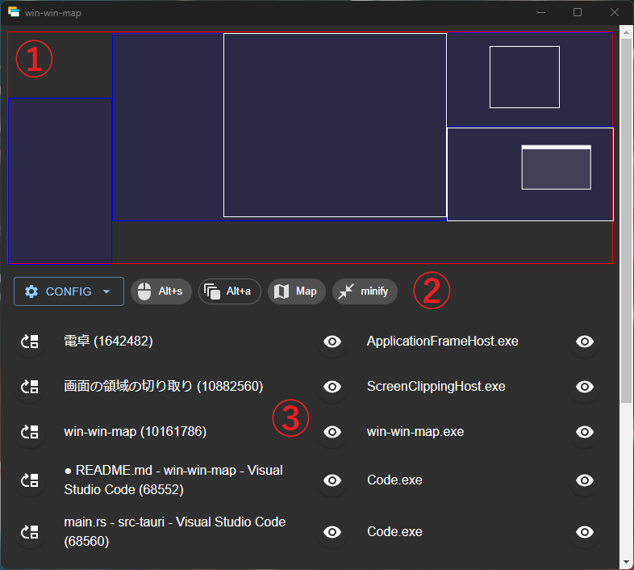
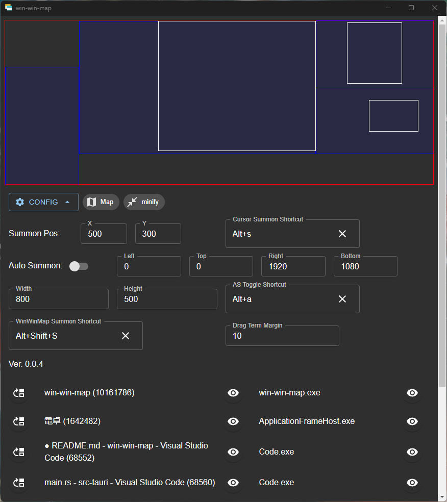

# win-win-map

※ 見た目はバージョンにより異なる可能性があります。

Windows' Windows Map、略してwin-win-mapは、マウスカーソル及びウィンドウを特定座標に移動させるWindows用ユーティリティアプリです！

- マウスカーソルを設定座標に召喚
- ウィンドウを設定座標に召喚
- マップ上のウィンドウをドラッグすることによる移動

等が主な機能になります。

リリースページ: https://github.com/anotherhollow1125/win-win-map/releases

ダウンロード: https://github.com/anotherhollow1125/win-win-map/releases/download/v0.0.4/win-win-map_0.0.4_x64_en-US.msi

## アプリのモチベーション

本アプリを作った製作者は、同じPCにも関わらず離れた位置にモニターがある作業環境で生活していました。

作業場所を変えた際にも同じウィンドウで作業を続けるために本アプリを制作いたしました。

よって制作者にしか需要がなさそうなアプリですが、使い方を記します。

## 使い方

- ① マップゾーン: ウィンドウの位置関係の把握及びウィンドウのドラッグによる移動が可能です。
  - 上に太いタイトルバー状の線がある: ドラッグ可能なウィンドウ
  - 薄く色がついたウィンドウ: アクティブウィンドウ
  - 上記2つは異なることもあります。 
- ② 設定ゾーン: 召喚座標、ショートカットなどの各種設定を行います(後述)。
- ③ リストゾーン: ウィンドウの一覧です。
  - 一番左のボタン: ウィンドウ召喚
  - 真ん中の目ボタン: ウィンドウ名称によるウィンドウ無視有効化無効化
    - 無視されたウィンドウはマップ上には表示されなくなります。
  - 一番右の目ボタン: 実行ファイル名によるウィンドウ無視有効化無効化

本アプリはメディアクエリを活用することで小さい状態ではマップとリストが非表示になるようになっております。

## 設定項目

### Config 折りたたみ時項目

| 項目名                 | 説明                                                                                      |
| :--------------------- | :---------------------------------------------------------------------------------------- |
| CONFIG                 | 詳細設定を展開します。                                                                    |
| マウスアイコンのチップ | 後述するCursor Summon Shortcutの現在値を確認できます。                                    |
| 四角が連なったチップ   | 後述するAuto Summonのクリックによる切り替え及びAS Toggle Shortcutの現在値を確認できます。 |
| Map                    | クリックでマップの表示/非表示を切り替えられます。                                         |
| minify/expand          | クリックで本アプリを小さくしたり、大きくしたりできます。                                  |

### Config 展開時項目

| 項目名                 | 説明                                                                                                         |
| :--------------------- | :----------------------------------------------------------------------------------------------------------- |
| Summon Pos             | マウスカーソル及びウィンドウの召喚座標です。                                                                 |
| Cursor Summon Shortcut ※1 | マウスカーソル召喚のショートカットを設定します。                                                             |
| Auto Summon            | 後述するしきい値の外に存在するウィンドウがアクティブになった際に、自動召喚する機能のオンオフを操作できます。 |
| Left Top Right Bottom  | このしきい値の外にあるウィンドウがAuto Summonの対象になります。                                              |
| Width Height           | 召喚されるウィンドウのサイズを指定します。                                                                   |
| AS Toggle Shortcut ※1    | Auto Summonのオンオフを切り替えるショートカットを設定します。 |
| WinWinMap Summon Shortcut ※1 | 本アプリを召喚するためのショートカットです。(Auto Summonの対象ではないためこの設定があります。) |
| Drag Term Margin | ※2 |

※1: 各種ショートカットの設定については、テキストフィールドにフォーカスした状態で設定したいショートカットキーをそのまま押下することで設定します。

※2: ウィンドウを移動させる際、座標がモニターのギリギリの場所であると表示がおかしくなってしまう事象が確認されているため、モニターの端から一定のマージンを取った場所にしかウィンドウを移動できない作りになっています。そのための設定項目です。

本アプリの挙動及び設定項目は制作者がほしいと考えたものが中心のため、もっと良い案や改善するべき点があればissueをいただけると幸いです。